# DesignBench: A Comprehensive Benchmark for MLLM-based Front-end Code Generation

Quick links: [Paper](https://arxiv.org/abs/2506.06251) ｜[Prompts](./code/prompt/all_prompt.py) | [Annotation Guideline](./assets/Guideline.md) | [Quick Start](./code/demo.ipynb) | [Dataset Download](https://drive.google.com/drive/folders/1gCeg4LqO7VsOSpB70iMnKbNR8gfzUot_) 


## 📜 Overview 
Multimodal Large Language Models (MLLMs) have demonstrated remarkable capabilities in automated front-end engineering, e.g., generating UI code from visual designs. However, existing front-end UI code generation benchmarks have the following limitations: (1) While framework-based development becomes predominant in modern front-end programming, current benchmarks fail to incorporate mainstream development frameworks. (2) Existing evaluations focus solely on the UI code generation task, whereas practical UI development involves several iterations, including refining editing, and repairing issues. (3) Current benchmarks employ unidimensional evaluation, lacking investigation into influencing factors like task difficulty, input context variations, and in-depth code-level analysis. To bridge these gaps, we introduce DesignBench, a multi-framework, multi-task evaluation benchmark for assessing MLLMs' capabilities in automated front-end engineering. DesignBench encompasses three widely-used UI frameworks (React, Vue, and Angular) alongside vanilla HTML/CSS, and evaluates on three essential front-end tasks (generation, edit, and repair) in real-world development workflows. DesignBench contains 900 webpage samples spanning over 11 topics, 9 edit types, and 6 issue categories, enabling detailed analysis of MLLM performance across multiple dimensions. Our systematic evaluation reveals critical insights into MLLMs' framework-specific limitations, task-related bottlenecks, and performance variations under different conditions, providing guidance for future research in automated front-end development.

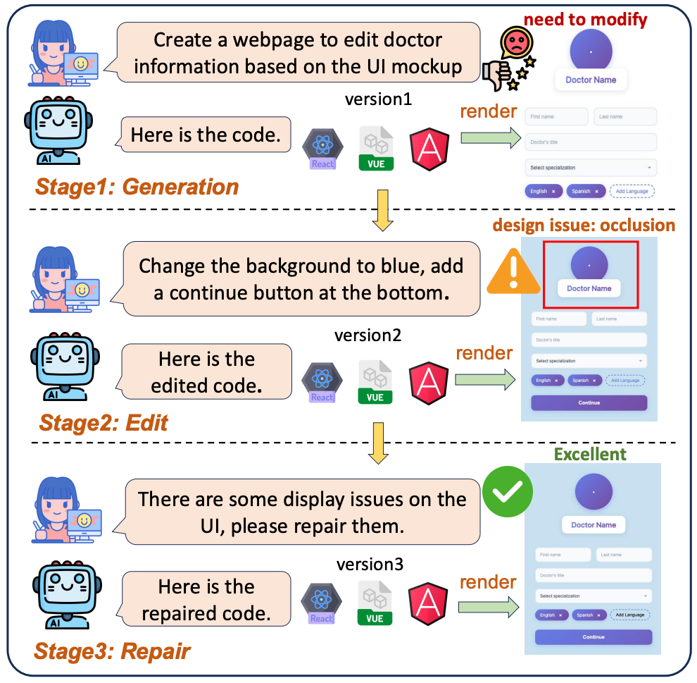


## 🛠️ Installation
```bash
git clone https://github.com/WebPAI/DesignBench.git
cd DesignBench
pip install -r requirements.txt
mkdir data
```

Download the [dataset](https://drive.google.com/drive/folders/1gCeg4LqO7VsOSpB70iMnKbNR8gfzUot_) and put it in the ''data'' folder.

## 🔐 API Key Setup
Before running, create a `.env` file in the root directory and set the following API keys:
```bash
GEMINI_API_KEY="<YOUR_GEMINI_API_KEY>"
OPENAI_API_KEY="<YOUR_OPENAI_API_KEY>"
DEEPINFRA_API_KEY="<YOUR_DEEPINFRA_API_KEY>"
QWEN_API_KEY="<YOUR_QWEN_API_KEY>"
ANTHROPIC_API_KEY="<YOUR_ANTHROPIC_API_KEY>"
MISTRAL_API_KEY="<YOUR_MISTRAL_API_KEY>"
```

## 🧩 Task & Framework Overview

### 🧪 Supported Tasks
| Task Type | Enum | Supported Mode | Description |
|:---|:---|:---|:---|
| Generation | `Task.GENERATION` | `Mode.IMAGE` | Generate frontend code from a UI image. |
| Edit | `Task.EDIT` | `Mode.IMAGE`, `Mode.CODE`, `Mode.BOTH` | Modify an existing UI based on requirements. `Mode.IMAGE` provides only the original image, `Mode.CODE` provides only the original code, and `Mode.BOTH` provides both. |
| Repair | `Task.REPAIR` | `Mode.IMAGE`, `Mode.CODE`, `Mode.BOTH`, `Mode.MARK` | Fix broken UI implementations. `Mode.IMAGE`, `Mode.CODE`, and `Mode.BOTH` work as `Task.EDIT`. `Mode.MARK` provides both the original image and code with a highlighted target area. |
| Compile Error Repair | `Task.COMPILE` | `Mode.CODE`, `Mode.BOTH` | Fix compilation errors in UI code. `Mode.CODE` provides the broken code only, while `Mode.BOTH` includes both the code and error messages. |


### 💻 Frameworks
| Framework Name | Enum |
|:---|:---|
| Vanilla HTML | `Framework.VANILLA` |
| React | `Framework.REACT` |
| Vue | `Framework.VUE` |
| Angular | `Framework.ANGULAR` |


## ⚙️ Quick Start
See `demo.ipynb` for hands-on guidance.


### Generation

```py
from runner.main import Runner
from utils import Framework, Task, Mode

# Initialize the Runner with a selected model and framework
runner = Runner(
    "gemini-2.0-flash",             # Name of the model to use (see mllm/__init__.py)
    framework=Framework.ANGULAR,    # Input framework (e.g., Angular source data)
    stream=True,                    # Enable streaming output for stability (default: True)
    print_content=True,             # Print model outputs to console (default: False)
)

runner.run(
    task=Task.GENERATION,               # Choose from: GENERATION, EDIT, REPAIR, COMPULE
    output_framework=Framework.REACT,   # Must match the input framework for EDIT, REPAIR, and COMPULE tasks
    mode=Mode.IMAGE,                    # Operation mode: IMAGE, CODE, BOTH, or MARK (see supported mode)
    max_workers=20,                     # Number of threads for parallel execution
    execution_range=(1,2),              # Optional: specify execution indices
)
```


### Evaluation

1. Configure the DesignBench project path in the config.py file.

```py
DesignBench_Path = "Your_DesignBench_Path"
```


2. Run the React/Vue/Angular Project

During evaluation, the code content in React/Vue/Angular Project will be replaced by the MLLMs' generated code.

```bash
cd web/my-react-app/
npm run dev

cd web/my-vue-app/
npm run dev

cd web/my-angular-app/
ng serve
```

4. Evaluation for Generation Task.

```py
from evaluator.main import *
from evaluator.compile import *
models = [
    "claude-3-7-sonnet-20250219",
    "gpt-4o-2024-11-20",
    "gemini-2.0-flash",
    "Llama-3.2-90B-Vision-Instruct",
    "Llama-3.2-11B-Vision-Instruct",
    "pixtral-large-latest",
    "pixtral-12b-2409",
    "qwen2.5-vl-72b-instruct",
    "qwen2.5-vl-7b-instruct"
] # Evaluated MLLMs

frame_works = ["react", "vue", "angular", "vanilla"] # the framework used to actually implement the webpage.
implemented_frame_works = ["react", "vue", "angular", "vanilla"] # the framework used by the MLLMs.

# collect the compile information
for frame_work in frame_works:
    if frame_work == "vanilla":
        continue
    for implemented in implemented_frameworks:
        collect_compile_information(task_name=Task.GENERATION, frame_work=frame_work, implemented_framework_or_mode=implemented)

evaluate_generation(models=models, frame_works=frame_works, implemented_frameworks=implemented_frame_works)
```


4. Evaluation for Edit Task.

```py
from evaluator.main import *
from evaluator.compile import *
models = [
    "claude-3-7-sonnet-20250219",
    "gpt-4o-2024-11-20",
    "gemini-2.0-flash",
    "Llama-3.2-90B-Vision-Instruct",
    "Llama-3.2-11B-Vision-Instruct",
    "pixtral-large-latest",
    "pixtral-12b-2409",
    "qwen2.5-vl-72b-instruct",
    "qwen2.5-vl-7b-instruct"
]

frame_works = ["react", "vue", "angular", "vanilla"]  # the framework used to actually implement the webpage.
modes = ["both", "code", "image"] # code, image, both
# collect the compile information
for frame_work in frame_works:
    if frame_work == "vanilla":
        continue
    for mode in modes:
        collect_compile_information(task_name=Task.EDIT, frame_work=frame_work, implemented_framework_or_mode=mode)

evaluate_generation(models=models, frame_works=frame_works, implemented_frameworks=implemented_frame_works)
evaluate_edit(models=models, frame_works=frame_works, modes=modes, llm_judge_flag=False)
evaluate_edit(models=models, frame_works=frame_works, modes=modes, llm_judge_flag=True)
```


5. Evaluation for Repair Task.

```py
from evaluator.main import *
from evaluator.compile import *
models = [
    "claude-3-7-sonnet-20250219",
    "gpt-4o-2024-11-20",
    "gemini-2.0-flash",
    "Llama-3.2-90B-Vision-Instruct",
    "Llama-3.2-11B-Vision-Instruct",
    "pixtral-large-latest",
    "pixtral-12b-2409",
    "qwen2.5-vl-72b-instruct",
    "qwen2.5-vl-7b-instruct"
]

frame_works = ["react", "vue", "angular", "vanilla"]  # the framework used to actually implement the webpage.
modes = ["both", "code", "image"]  # code, image, both
# collect the compile information
for frame_work in frame_works:
    if frame_work == "vanilla":
        continue
    for mode in modes:
        collect_compile_information(task_name=Task.REPAIR, frame_work=frame_work, implemented_framework_or_mode=mode)
evaluate_repair(models=models, frame_works=frame_works, modes=modes, llm_judge_flag=False)
evaluate_repair(models=models, frame_works=frame_works, modes=modes, llm_judge_flag=True)
```


## 🌰️ Examples

Some good and bad examples.


### Generation
- Example1

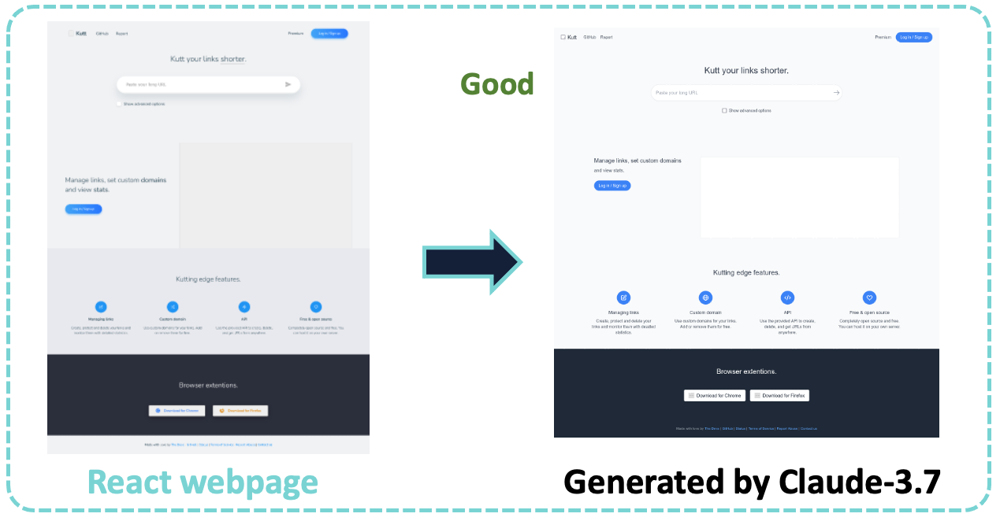
- Example2


- Example3

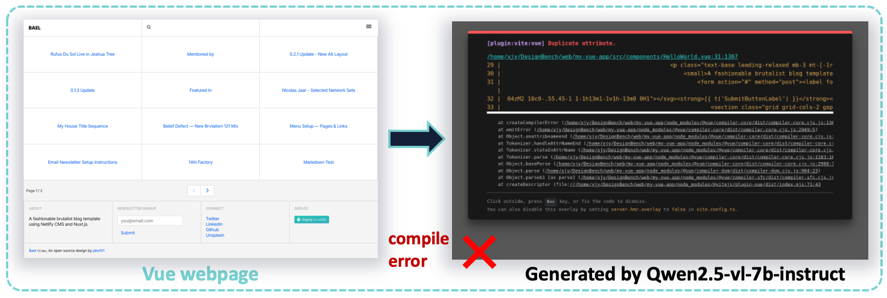

- Example4


- Example5

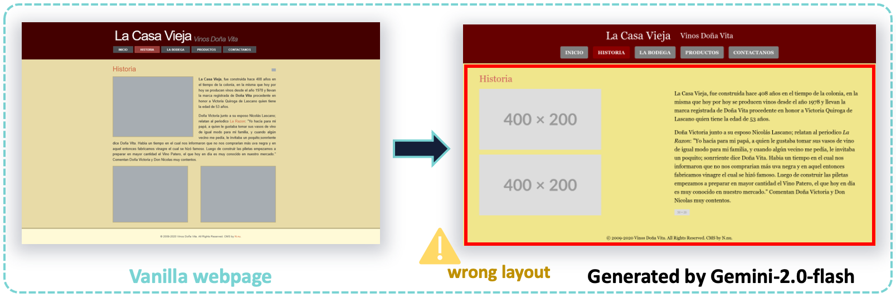

### Edit

- Example1

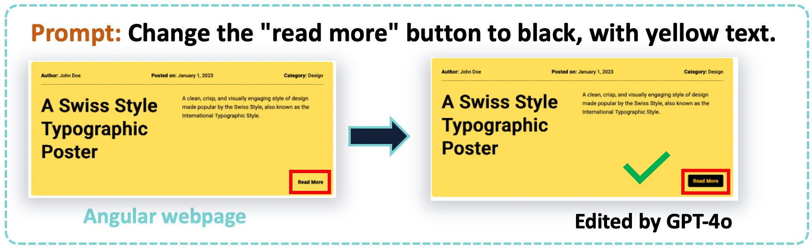

- Example2

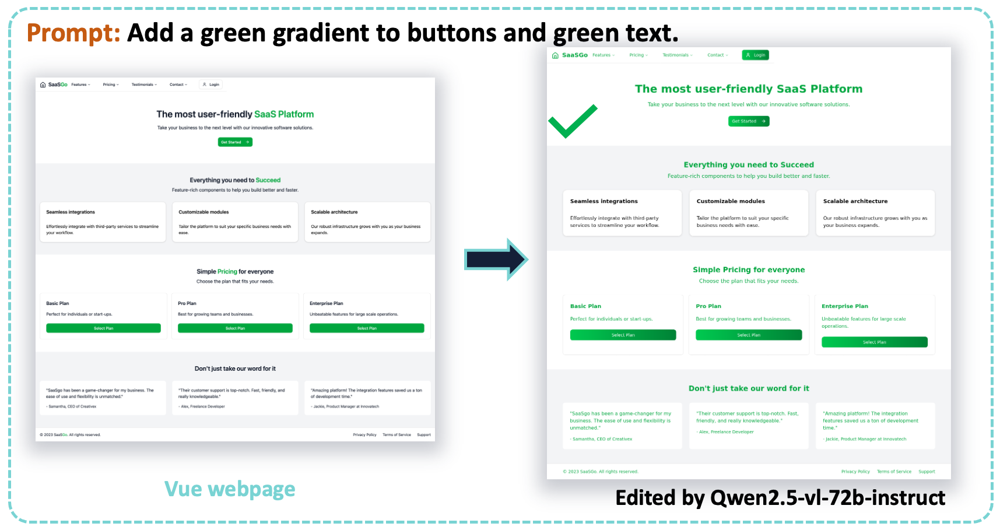

- Example3

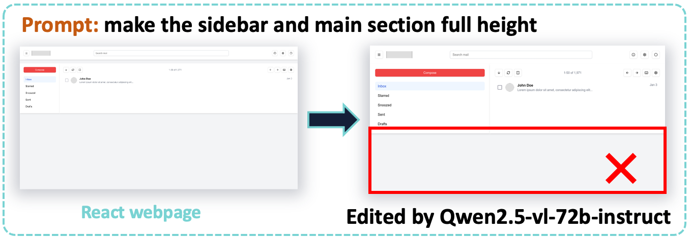
- Example4

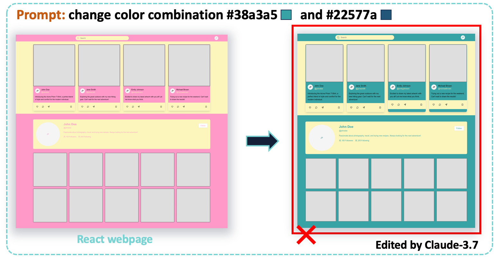
- Example5

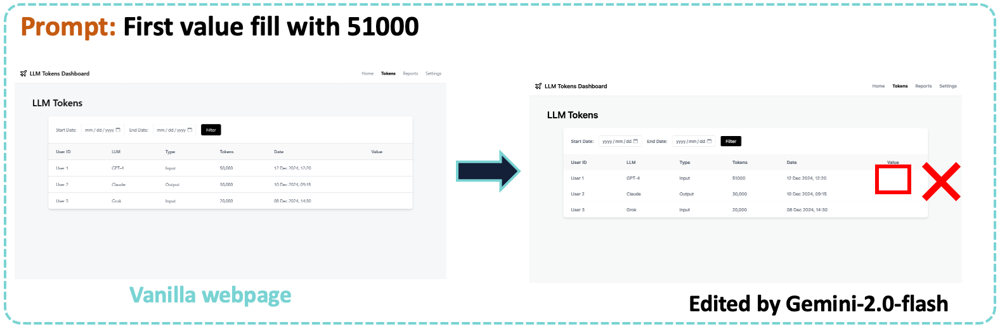

### Repair
- Example1

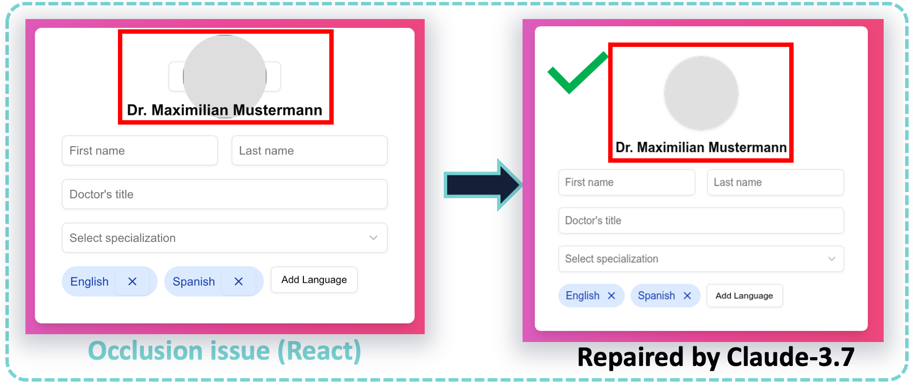

- Example2

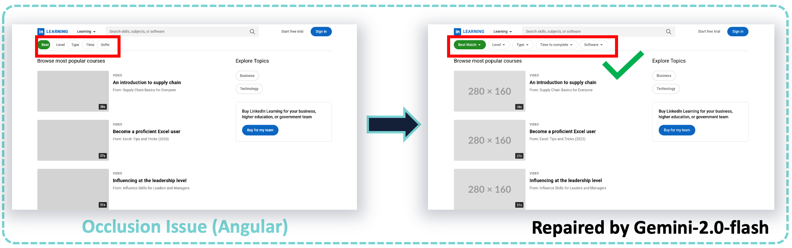

- Example3

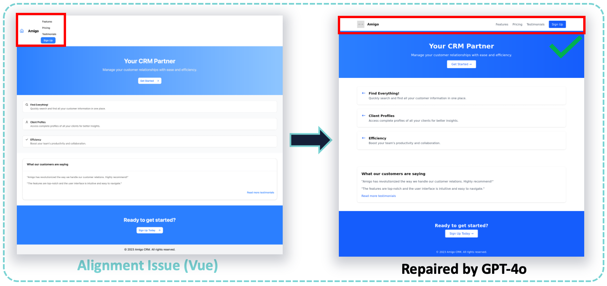

- Example4

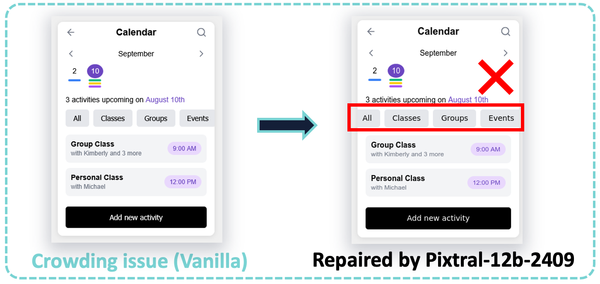
- Example5

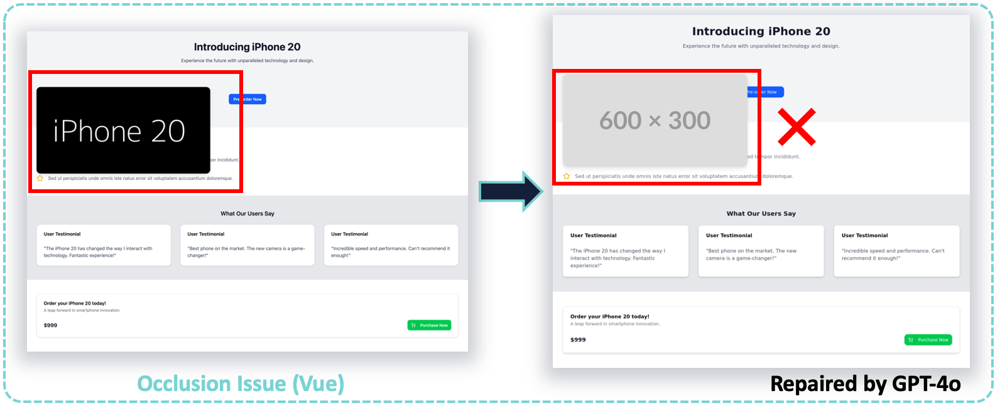


## 🔥 Citation

```
@misc{xiao2025designbench,
      title={DesignBench: A Comprehensive Benchmark for MLLM-based Front-end Code Generation}, 
      author={Jingyu Xiao and Ming Wang and Man Ho Lam and Yuxuan Wan and Junliang Liu and Yintong Huo and Michael R. Lyu},
      year={2025},
      eprint={2506.06251},
      archivePrefix={arXiv},
      primaryClass={cs.SE},
      url={https://arxiv.org/abs/2506.06251}, 
}
```
