# Failure Type Annotation Guidelines

## DesignGeneration

### Task Overview

You will be given the screenshots of original webpages and model-generated webpages. Your task is to catergorize the results into (1) Compile Error, (2) Layout Disorder, (3) Wrong Position, (4) Wrong Color, (5) Wrong Text, (6) Wrong Size, (7) element missing and (8) good generation. The purpose is to analyze the front-end code generation ability of different models aross multi  frameworks (React, Vue, Angular and Vanilla).

### Guidelines

#### 1. Compile Error
Incorrect compilation of frontend code leading to page compilation errors. The page result may include complete error information or may be blank (e.g., in Angular). As shown in the figure below, the generated webpage produces an error message "Error: Unsupported Server Component type: undefined" indicating a compilation error.

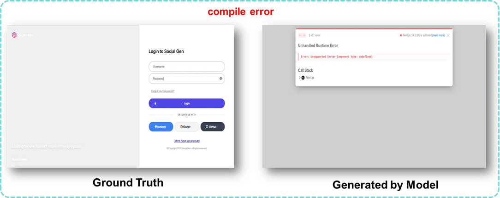

#### 2. Layout Disorder
The generated webpage exhibits significant layout issues (such as overlapping components and text module overflow), resulting in inconsistencies with the original webpage. As demonstrated in the example below, the form overflows the page's maximum height.

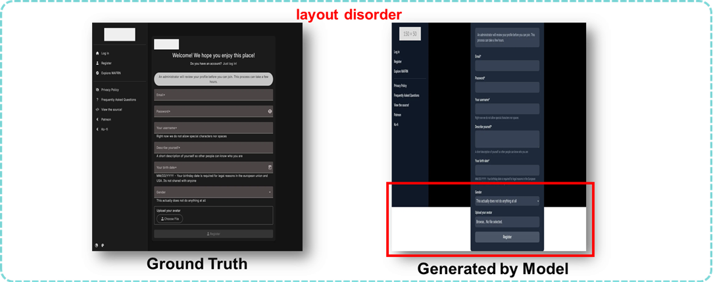

#### 3. Wrong Position
In the generated webpage, the positioning of certain elements, components, or text shows significant inconsistencies with the original webpage's layout. For example, as shown in the figure below, the logo on the original webpage is centered, but the logo on the generated webpage is aligned to the left.

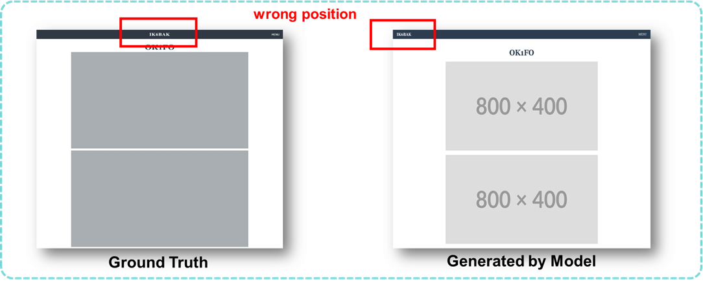

#### 4. Wrong Color
In the generated webpage, the colors of certain elements, components, or text differ significantly from the original page. For example, as shown in the image below, the “save” button at the bottom of the page was originally gray, but it appears blue in the generated webpage.

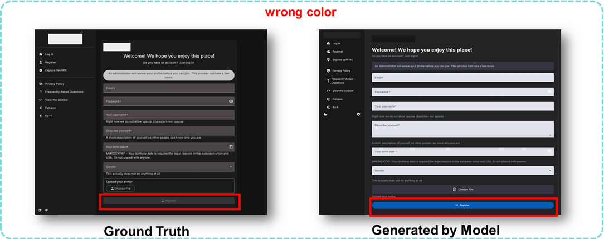

#### 5. Wrong Text
In the generated webpage, the text content differs from the original webpage. This could be due to the text being modified or appearing as garbled characters. For example, as shown in the image below, the text content exhibits meaningless loops at the end, which do not match the original webpage's text content.

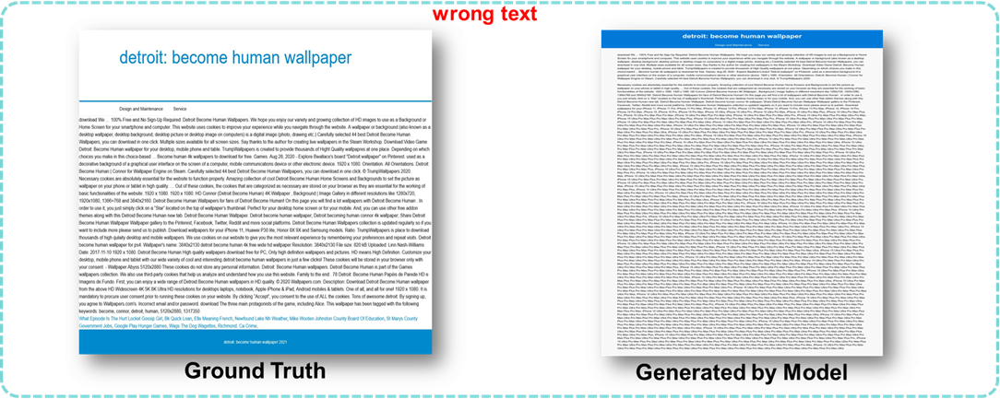

#### 6. Wrong Size
If the proportions of components in the generated webpage differ significantly from the original page, they are categorized as “wrong size.” As shown in the example below, the tags under “Genres” appear excessively narrow in the generated output, noticeably narrower than their original layout on the source webpage.、

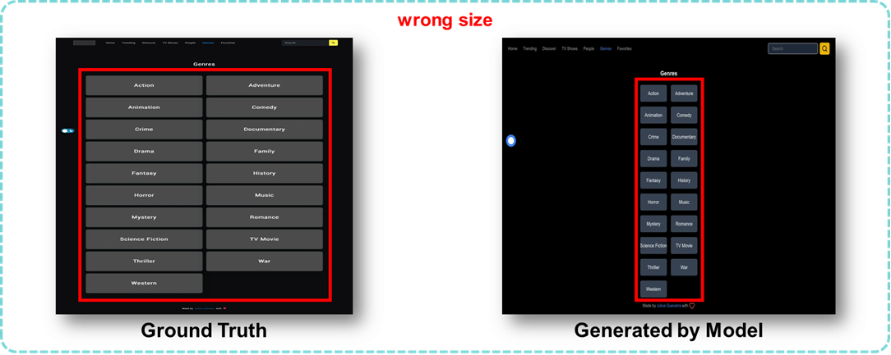

#### 7. Element Missing
Some components present in the original webpage are missing from the generated webpage. As shown in the example below, the light gray button in the bottom-right corner fails to appear in the generated webpage.

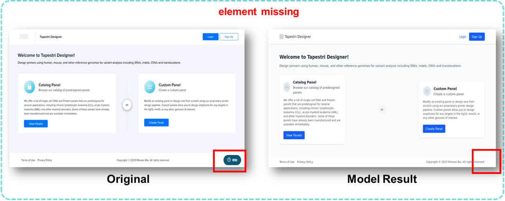

#### 8. Good Generation
The page generated is relatively ideal, meaning it visually aligns with the original webpage and does not meet the conditions of the above (1), (2), (3), (4), (5), (6) or (7). 

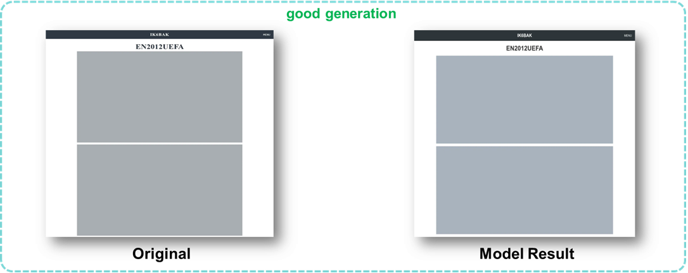

## DesignEdit

### Task Overview

You will be given the original webpages, prompts, results of edited webpages and ground truth webpages. Your task is to classify the results into several categories: (1) Compile Error, (2) No Edit, (3) Wrong Object, (4) Wrong Edit, (5) Partial Edit, (6) Unnecessary Modification, and (7) Good Edit, based on the guidelines as follows. The goal is to analyse the performance of DesignEdit tasks across different models and frameworks (React, Vue, Angular and Vanilla).

### Guidelines

#### 1. Compile Error
Incorrect compilation of front-end code leading to page compilation errors. The page result may include complete error information or may be blank (e.g., in Angular). As shown in the figure below, the page after editing produces an error message "x unexpected token 'div'. Expected jsx identifier," indicating a compilation error.

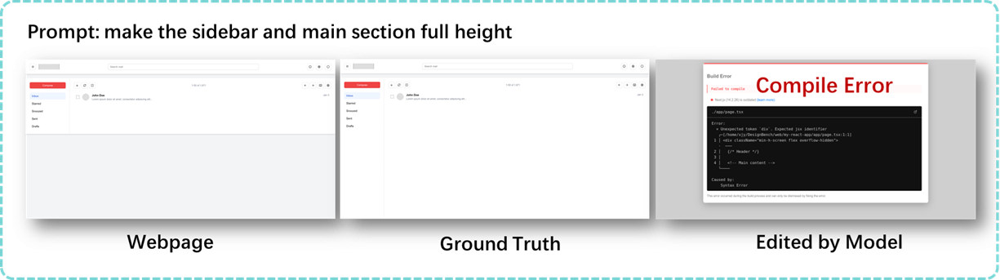

#### 2. No Edit
The generated page after editing is identical to the one before editing, with no changes produced. As shown in the figure below, the result edited by the model is almost identical to the webpage before modification, completely failing to implement any requirements from the prompt.

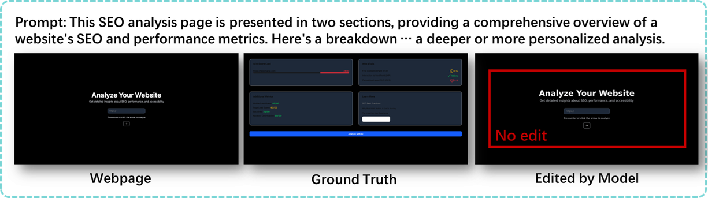

#### 3. Wrong Object
Modifications to the parts and components expected by the prompt are erroneously applied to other components and sections of the page. As shown in the figure below, the result after editing sets the height of the bottom image in the skeleton to 100px high, but the prompt requires the entire skeleton to be set to 100px high.

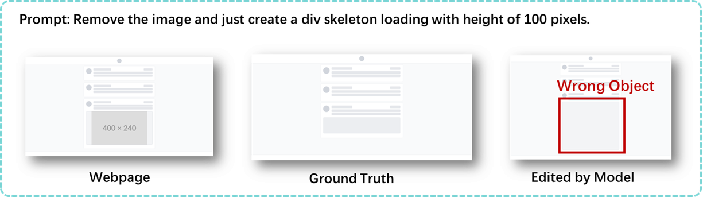

#### 4. Wrong Edit
The modifications to the parts expected by the prompt are suboptimal, leading to results that clearly deviate from the intent of the prompt. As shown in the figure below, the column is successfully generated but falsely added to the right instead of the left, violating the prompt's requirements.

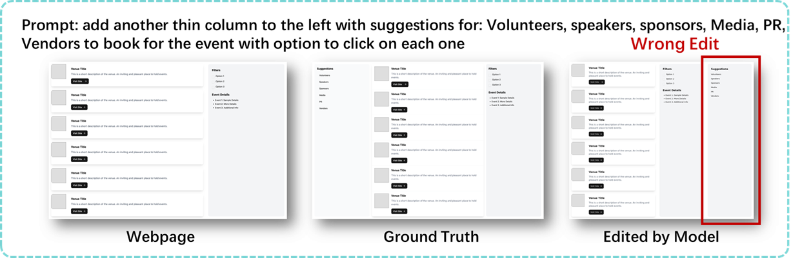

#### 5. Partial Edit
The page after editing only satisfies part of the prompt's requirements, while other modifications are not implemented. In the example below, although all "SP" suffixes are removed, not all Storypoints are moved to the right side.

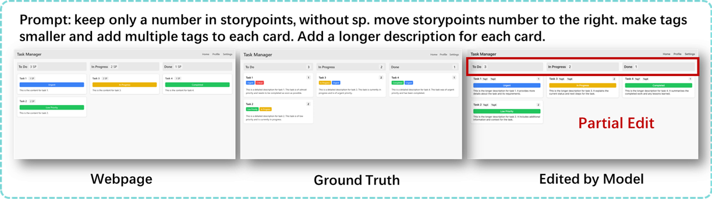

#### 6. Unnecessary Modification
The page after editing introduces modifications and changes to parts that were not requested, leading to unnecessary changes and impacts. In the example shown in the figure: The main part of the webpage is erased for no reason.

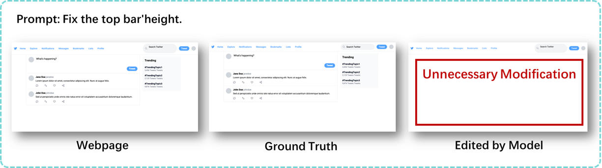

#### 7.	Good Edit
The page modifications is relatively ideal, meaning it reasonably satisfies all requirements of the prompt and does not meet the conditions of the above (1), (2), (3), (4), (5), or (6).

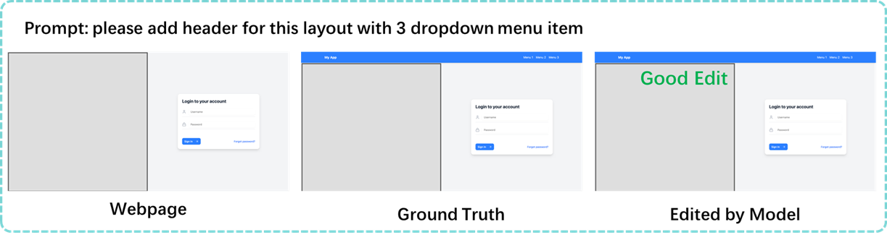

Labelers should refer to the above guidelines, combined with the prompt and ground truth, to judiciously judge and label the edited results.

## DesignRepair

### Task Overview

You will be given the original webpages, results of repaired webpages and ground truth webpages. Your task is to classify the results into several categories: (1) Compile Error, (2) No Repair, (3) Wrong Object, (4) Wrong Repair, (5) Partial Repair, (6) Unnecessary Modification, and (7) Good Repair, based on the guidelines as follows. The goal is to analyse the performance of DesignRepair tasks across different models and frameworks (React, Vue, Angular and Vanilla).

### Guidelines

#### 1. Compile Error
Incorrect compilation of front-end code leading to page compilation errors. The page result may include complete error information or may be blank (e.g., in Angular). As shown in the figure below, the page after editing produces an error message "At last one \<template\> or \<script\> is required in a single file component" indicating a compilation error.

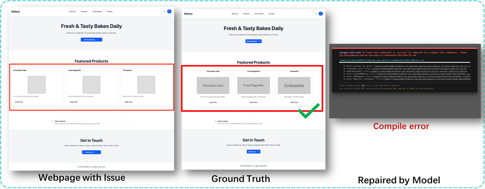

#### 2. No Repair
The generated page after repairing is identical to the one before repairing, with no changes produced. As shown in the figure below, in the repaired webpage, the issue of misalignment remains without any changes.

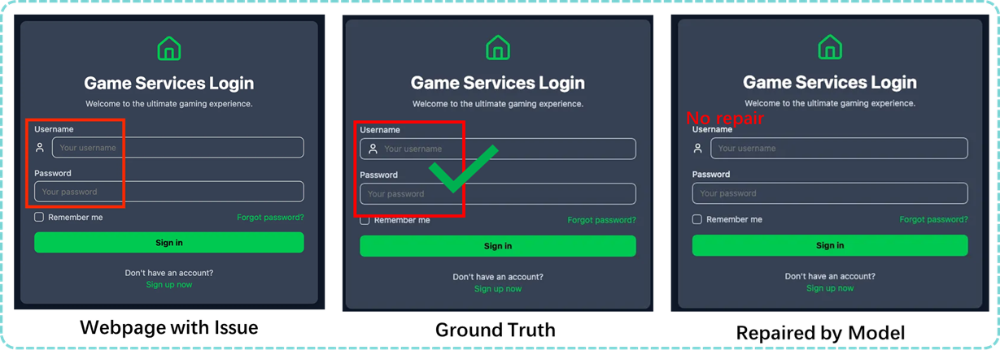

#### 3. Wrong Object
Modifications to the parts and components expected to be fixed are erroneously applied to other components and sections of the page. As shown in the figure below, instead of fixing the alignment of checkboxes and texts, the result after repairing moves the "Apply Filters" button to the left, which's original order is not regarded as a issue.

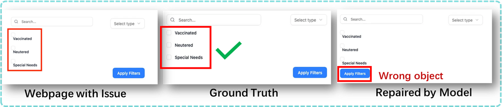

#### 4. Wrong Repair
 The component requiring repair was successfully modified, but the repair did not meet expectations.As shown in the figure below, the three buttons' positions have been changed, but still fails in length alignment.

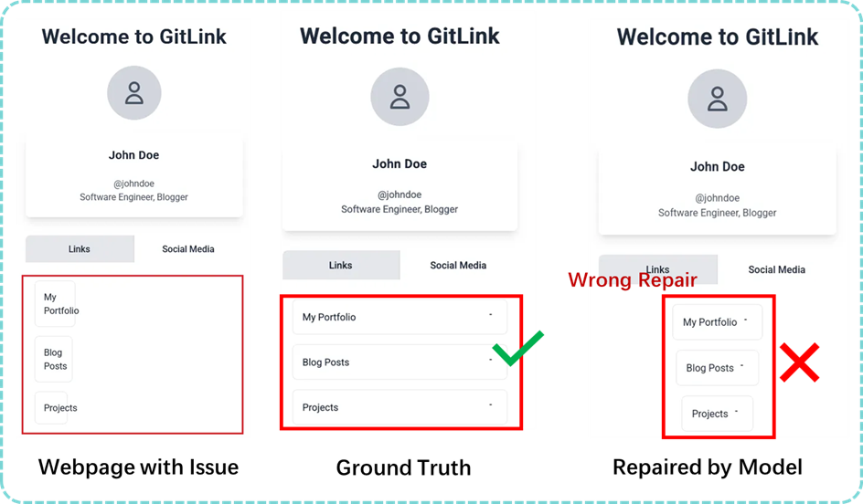

#### 5. Partial Repair
The page after repairing only solves part of the issues, while other problems are neglected. In the example below, although the image have been aligned to the center, the blue bar below does not follow.

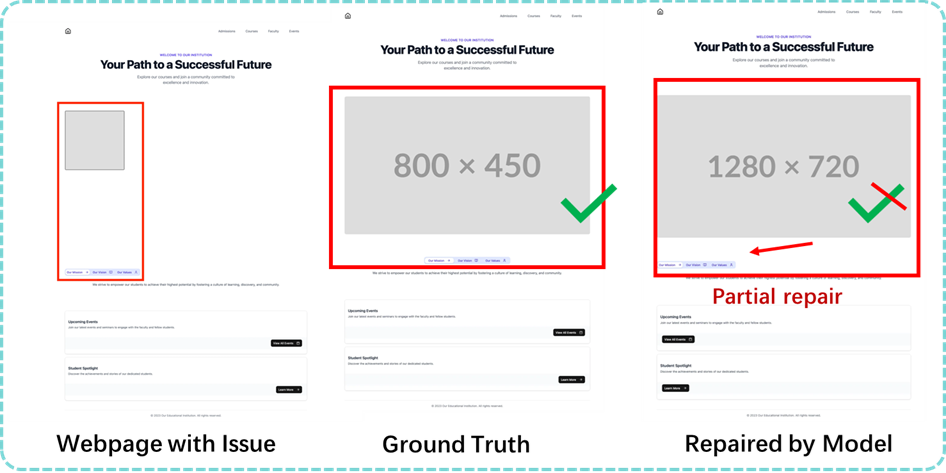

#### 6. Unnecessary Modification
The page after repairing introduces modifications and changes to parts that were not considered issues, leading to unnecessary changes and impacts. In the example shown in the figure, the overflow problem of login options have been solved but the dark theme has been switched to light theme,  which is not necessary to modify.

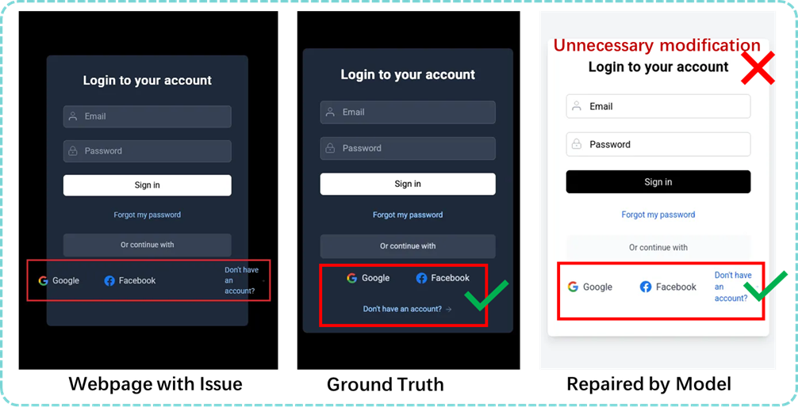

#### 7.	Good Repair
The page repair is relatively ideal, meaning it reasonably solves all the significant webpage lalyout issues and does not meet the conditions of the above (1), (2), (3), (4), (5), or (6).

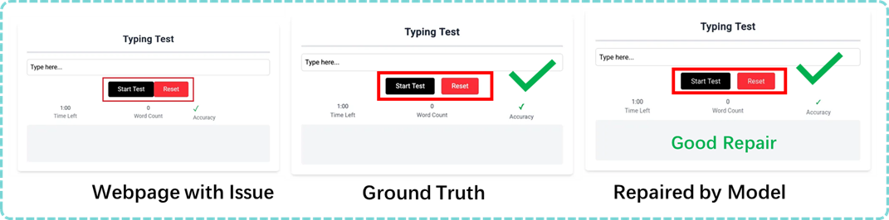